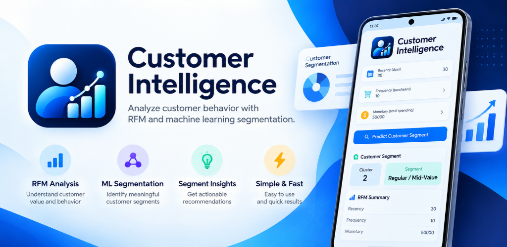
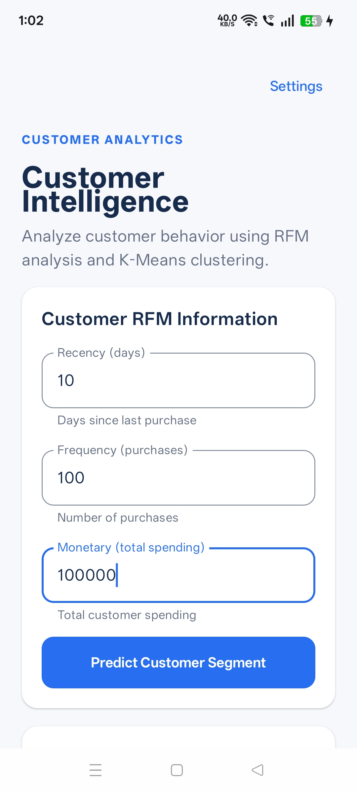
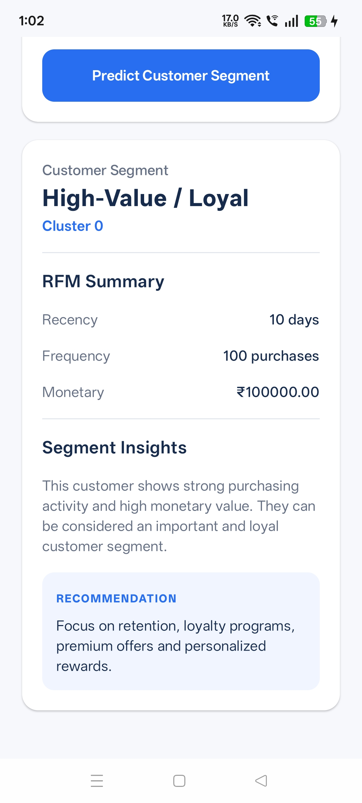
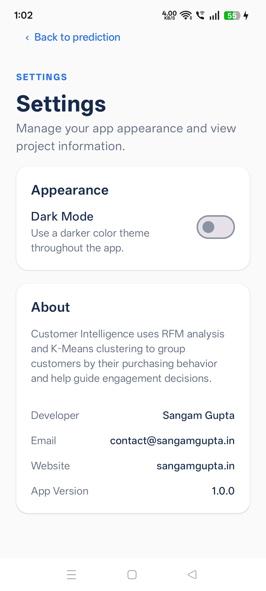

# 🧠 Customer Intelligence & Segmentation

> An end-to-end unsupervised machine learning application that analyzes customer behavior using RFM analysis and K-Means clustering, then delivers customer segmentation through FastAPI, Streamlit, and a native Android application.

<p align="center">
  
</p>

<p align="center">
  <a href="https://customer-intelligence-segmentation.streamlit.app/">🌐 Streamlit Web App</a> •
  <a href="https://play.google.com/apps/testing/com.sangamgupta.customerintelligence">📱 Android Closed Testing</a> •
  <a href="https://github.com/TheSangamX/customer-intelligence-segmentation">💻 GitHub</a> •
  <a href="http://3.110.155.47:8000/docs">🧪 API Docs</a>
</p>

<p align="center">
  
  
  
  
  
  
  
</p>

---

## 📌 Overview

**Customer Intelligence & Segmentation** is an end-to-end machine learning project designed to demonstrate how an unsupervised ML workflow can move from transaction data and exploratory analysis to a usable, deployed application.

The project combines:

- 🧠 RFM feature engineering
- 🎯 K-Means clustering as the main production model
- 🌳 Hierarchical Clustering with dendrogram analysis
- 🔵 DBSCAN for density-based clustering and noise detection
- 📉 PCA for dimensionality reduction and visualization
- 📊 Silhouette Score for cluster evaluation
- ⚡ FastAPI REST API
- 🌐 Streamlit web application
- 📱 Native Android application using Kotlin and Jetpack Compose
- ☁️ AWS EC2 deployment
- 🔄 Persistent backend execution using systemd

Both the Streamlit web application and Android application communicate with the same FastAPI prediction backend.

---

# 🚀 Live Applications & Resources

| Resource | Link |
|---|---|
| 🌐 **Streamlit Web Application** | [Open Web App](https://customer-intelligence-segmentation.streamlit.app/) |
| 📱 **Android Closed Testing** | [Join / Open Testing](https://play.google.com/apps/testing/com.sangamgupta.customerintelligence) |
| 🧪 **FastAPI Swagger API** | [Open API Docs](http://3.110.155.47:8000/docs) |
| 💻 **GitHub Repository** | [View Repository](https://github.com/TheSangamX/customer-intelligence-segmentation) |

> **Note:** The current backend uses a public HTTP endpoint for learning and deployment testing. HTTPS, authentication, and a custom domain are planned production-hardening improvements.

---

# 🎯 Project Objective

The objective was not only to build a clustering model, but to understand how an **unsupervised machine learning workflow can become a complete application**.

```text
Transaction Data
       ↓
Exploratory Data Analysis
       ↓
Data Cleaning
       ↓
RFM Feature Engineering
       ↓
Feature Scaling
       ↓
K-Means Clustering
       ↓
Cluster Evaluation
       ↓
Business Segment Interpretation
       ↓
Model Serialization
       ↓
FastAPI REST API
       ↓
AWS EC2 Deployment
       ↓
 ┌─────┴─────┐
 ↓           ↓
Streamlit   Android
```

**Machine Learning + Customer Analytics + API Development + Cloud Deployment + Web Development + Android Development**

---

# 🔄 End-to-End Workflow

```text
┌──────────────────────┐
│ Transaction Dataset  │
└──────────┬───────────┘
           ↓
┌──────────────────────┐
│ EDA & Data Cleaning  │
└──────────┬───────────┘
           ↓
┌──────────────────────┐
│ RFM Feature          │
│ Engineering          │
└──────────┬───────────┘
           ↓
┌──────────────────────┐
│ StandardScaler       │
└──────────┬───────────┘
           ↓
┌──────────────────────┐
│ K-Means Clustering   │
│ Main Model           │
└──────────┬───────────┘
           ↓
    ┌──────┼──────┐
    ↓      ↓      ↓
Hierarchical DBSCAN PCA
Comparison  Analysis Visualization
    └──────┼──────┘
           ↓
┌──────────────────────┐
│ Evaluation &         │
│ Business Insights    │
└──────────┬───────────┘
           ↓
┌──────────────────────┐
│ FastAPI REST API     │
│ POST /predict        │
└──────────┬───────────┘
           ↓
      ┌────┴────┐
      ↓         ↓
 Streamlit   Android
```

---

# ✨ Key Features

## 🤖 Machine Learning

- RFM-based customer feature engineering
- Customer-level behavioral segmentation
- K-Means as the main production clustering algorithm
- Elbow/knee analysis for candidate K selection
- KneeLocator integration
- Silhouette Score evaluation
- Hierarchical Clustering comparison
- Dendrogram visualization
- DBSCAN noise/outlier analysis
- PCA dimensionality reduction
- StandardScaler for distance-based clustering
- Business-friendly customer segment labels
- Saved model and scaler artifacts for API inference

## ⚡ FastAPI REST API

- `GET /` health/status endpoint
- `POST /predict` prediction endpoint
- Pydantic request validation
- JSON request/response handling
- Saved ML artifact loading
- Uvicorn ASGI server
- Swagger/OpenAPI documentation
- AWS EC2 deployment
- systemd service

## 🌐 Streamlit Web Application

The deployed Streamlit application accepts:

- Recency
- Frequency
- Monetary

It then displays:

- Customer cluster
- Customer segment
- RFM summary
- Segment insights
- Business recommendation
- RFM visualization

## 📱 Android Application

The native Android application provides:

- RFM input form
- Customer segment prediction
- Segment insights
- Business recommendation
- Loading state
- API error handling
- Settings screen
- Dark Mode
- Developer/contact information
- Website and version information
- Custom application icon

> The Android application does **not** run the ML model locally. It communicates with the deployed FastAPI backend.

---

# 📊 RFM Analysis

RFM converts transaction-level behavior into customer-level features.

| Metric | Meaning | General Interpretation |
|---|---|---|
| **Recency** | Days since the latest purchase | Lower is generally better |
| **Frequency** | Number of purchases | Higher generally indicates stronger engagement |
| **Monetary** | Total customer spending | Higher indicates greater monetary value |

```text
Transaction Data
       ↓
CustomerID + InvoiceDate + TotalAmount
       ↓
RFM Aggregation
       ↓
Recency + Frequency + Monetary
       ↓
Customer-Level Dataset
```

These features are scaled before distance-based clustering.

---

# 🧠 Machine Learning Workflow

## 1. Exploratory Data Analysis

The transaction dataset was explored for:

- Structure and data types
- Missing values
- Duplicate records
- Numerical distributions
- Categorical distributions
- Customer counts
- Transaction dates
- Spending behavior
- Outliers and data quality

## 2. Data Cleaning

Cleaning includes:

- Converting `InvoiceDate` to datetime
- Handling missing categorical values
- Removing duplicate transaction records
- Checking data types and numerical values

## 3. RFM Feature Engineering

Transaction-level records are aggregated by customer to calculate:

- Recency
- Frequency
- Monetary

## 4. Feature Scaling

```python
from sklearn.preprocessing import StandardScaler

scaler = StandardScaler()
X_scaled = scaler.fit_transform(X)
```

Scaling is important because distance-based clustering can otherwise be dominated by features with larger numerical ranges.

## 5. K-Means Clustering

K-Means is the main clustering model used by the deployed prediction service.

```text
Choose K
   ↓
Initialize Centroids
   ↓
Assign Customers
   ↓
Recalculate Centroids
   ↓
Repeat Until Convergence
   ↓
Customer Clusters
```

### K Selection

The project evaluates inertia across different K values and uses `KneeLocator` to identify a candidate elbow:

```python
from kneed import KneeLocator

kl = KneeLocator(
    range(1, 10),
    inertia,
    curve="convex",
    direction="decreasing"
)

optimal_k = kl.elbow
```

## 6. Cluster Evaluation

**Silhouette Score** is used to evaluate cluster compactness and separation. It is treated as an evaluation signal rather than a universal pass/fail threshold.

---

# 🎯 Clustering Algorithms

| Algorithm | Role in Project | Key Concept |
|---|---|---|
| **K-Means** | Main production model | Centroid |
| **Hierarchical** | Model comparison | Dendrogram |
| **DBSCAN** | Density and noise analysis | Core / Border / Noise |
| **PCA** | Dimensionality reduction and visualization | Principal Components |

### K-Means

The main production algorithm. It groups customers around learned centroids and requires a chosen number of clusters.

### Hierarchical Clustering

Agglomerative clustering starts with individual points and progressively merges clusters. A dendrogram visualizes the merge hierarchy.

### DBSCAN

A density-based method explored for irregular cluster structures and noise/outlier detection.

### PCA

Used for dimensionality reduction and visualization of the customer feature space. PCA is **not** the production prediction algorithm.

---

# 👥 Customer Segments

The generated clusters are interpreted using business-friendly segment labels.

### 💎 High-Value / Loyal

Strong purchasing activity and high monetary value.

**Recommendation:** retention, loyalty programs, premium offers, and personalized rewards.

### 📈 Regular / Mid-Value

Moderate purchasing activity and spending behavior.

**Recommendation:** personalized promotions, cross-selling, and engagement strategies.

### 💤 Inactive / Low-Value

Relatively low purchasing activity and/or lower monetary value.

**Recommendation:** re-engagement campaigns, targeted offers, and reactivation strategies.

> Segment names are business interpretations of the generated clusters and should be validated against the underlying customer behavior.

---

# 🖼️ Screenshots & Project Assets

## 🌟 Feature Graphic

<p align="center">
  
</p>

## 📱 Android Application

### RFM Input

<p align="center">
  
</p>

### Customer Segment Result

<p align="center">
  
</p>

### Settings

<p align="center">
  
</p>

## 🌐 Streamlit Web Application

A PDF snapshot of the deployed Streamlit application is included in the repository.

**[📄 View Streamlit Web Application PDF](assets/w1.pdf)**

The PDF demonstrates the deployed RFM input, customer segment result, segment insights, business recommendation, and RFM visualization.

---

# 🛠️ Technology Stack

| Layer | Technology |
|---|---|
| Programming | Python |
| Data Analysis | Pandas |
| Numerical Computing | NumPy |
| Machine Learning | scikit-learn |
| Main Clustering | K-Means |
| Comparison Clustering | Hierarchical, DBSCAN |
| Dimensionality Reduction | PCA |
| Evaluation | Silhouette Score |
| K Selection | KneeLocator |
| Serialization | Joblib |
| Backend | FastAPI |
| API Server | Uvicorn |
| Validation | Pydantic |
| Web App | Streamlit |
| HTTP Client | Requests |
| Visualization | Matplotlib |
| Android | Kotlin + Jetpack Compose |
| Cloud | AWS EC2 |
| Server OS | Ubuntu |
| Service Manager | systemd |
| Version Control | Git + GitHub |

---

# 🏗️ System Architecture

```text
                    ┌───────────────────┐
                    │       User        │
                    └─────────┬─────────┘
                              │
                 ┌────────────┴────────────┐
                 ↓                         ↓
       ┌──────────────────┐      ┌──────────────────┐
       │  Streamlit Web   │      │  Native Android  │
       │      App         │      │       App        │
       └────────┬─────────┘      └────────┬─────────┘
                │                         │
                └────────────┬────────────┘
                             ↓
                  ┌──────────────────────┐
                  │    FastAPI Backend   │
                  │      POST /predict   │
                  └──────────┬───────────┘
                             ↓
                  ┌──────────────────────┐
                  │ RFM Processing +     │
                  │ Saved ML Artifacts   │
                  └──────────┬───────────┘
                             ↓
                  ┌──────────────────────┐
                  │    K-Means Model     │
                  └──────────┬───────────┘
                             ↓
                  ┌──────────────────────┐
                  │  Customer Segment    │
                  └──────────────────────┘
```

---

# ⚙️ API Reference

## `GET /`

Checks whether the API is running.

```text
http://3.110.155.47:8000/
```

## `POST /predict`

Accepts RFM information and returns a cluster and business segment.

### Example Request

```json
{
  "recency": 30,
  "frequency": 10,
  "monetary": 50000
}
```

### Example Response

```json
{
  "cluster": 2,
  "segment": "Regular / Mid-Value"
}
```

> Exact results depend on the trained clustering artifacts and submitted values.

### Swagger

[Open FastAPI Swagger Documentation](http://3.110.155.47:8000/docs)

---

# 📂 Repository Structure

```text
customer-intelligence-segmentation/
│
├── android-app/
│   └── CustomerIntelligence/
│       ├── app/
│       ├── gradle/
│       ├── build.gradle.kts
│       ├── gradle.properties
│       ├── gradlew
│       ├── gradlew.bat
│       └── settings.gradle.kts
│
├── assets/
│   ├── f1.png
│   ├── s1.jpg
│   ├── s2.jpg
│   ├── s3.jpg
│   └── w1.pdf
│
├── backend/
│   ├── main.py
│   └── schemas.py
│
├── data/
│   └── raw/
│
├── models/
│   ├── kmeans_model.joblib
│   └── scaler.joblib
│
├── notebook/
│   └── customer_segmentation.ipynb
│
├── web-app/
│   └── app.py
│
├── .gitignore
├── README.md
└── requirements.txt
```

---

# 📱 Android Application

### Architecture

```text
User Input
    ↓
Jetpack Compose UI
    ↓
Customer RFM Data
    ↓
Retrofit / HTTP
    ↓
AWS FastAPI /predict
    ↓
Prediction Response
    ↓
Segment + Insights
```

### Application Details

```text
Application Name: Customer Intelligence
Package: com.sangamgupta.customerintelligence
Version: 1.0.0
```

### 🧪 Google Play Closed Testing

The Android application is currently available through Google Play closed testing.

**[📱 Join / Open Closed Testing](https://play.google.com/apps/testing/com.sangamgupta.customerintelligence)**

Testers may need to join the closed testing program with an eligible Google account before installing the application.

---

# 🚀 Getting Started

## 1. Clone

```bash
git clone https://github.com/TheSangamX/customer-intelligence-segmentation.git
cd customer-intelligence-segmentation
```

## 2. Create Virtual Environment

### Windows

```bash
python -m venv .venv
.venv\Scripts\activate
```

### Linux / macOS

```bash
python3 -m venv .venv
source .venv/bin/activate
```

## 3. Install Dependencies

```bash
pip install -r requirements.txt
```

## 4. Start FastAPI

```bash
python -m uvicorn backend.main:app --host 0.0.0.0 --port 8000
```

Swagger:

```text
http://127.0.0.1:8000/docs
```

## 5. Run Streamlit

```bash
streamlit run web-app/app.py
```

For the deployed web application, Streamlit communicates with the AWS-hosted FastAPI backend.

## 6. Run Android

1. Open the Android project in Android Studio.
2. Allow Gradle synchronization to complete.
3. Ensure the required Android SDK is installed.
4. Connect a device or start an emulator.
5. Build and run the application.
6. Use the deployed API base URL for cloud testing.

---

# ☁️ Deployment

The FastAPI backend was deployed on an **AWS EC2 Ubuntu server**.

Deployment included:

1. EC2 instance setup
2. Security group configuration
3. SSH access
4. Git repository cloning
5. Python virtual environment creation
6. Dependency installation
7. Uvicorn/FastAPI setup
8. Swagger/OpenAPI testing
9. systemd service configuration
10. Automatic service startup using `systemctl enable`
11. Port `8000` network access
12. Streamlit connection to the AWS API
13. Android connection to the same AWS API

### Deployment Architecture

```text
GitHub Repository
       ↓
AWS EC2
       ↓
Ubuntu Server
       ↓
Python Virtual Environment
       ↓
FastAPI + Uvicorn
       ↓
systemd
       ↓
K-Means Artifacts
       ↓
 ┌─────┴─────┐
 ↓           ↓
Streamlit   Android
```

---

# 🔒 Current Deployment Notes

The current backend is exposed through:

```text
http://3.110.155.47:8000
```

This setup is suitable for the current learning and deployment environment.

For production hardening, consider:

- HTTPS
- Custom backend domain
- API authentication
- Nginx reverse proxy
- Rate limiting
- Restricted network access
- Monitoring and logging
- Stable public IP / Elastic IP

---

# 📊 Project Status

## Completed

- [x] Transaction dataset
- [x] Exploratory Data Analysis
- [x] Missing-value handling
- [x] Duplicate detection and removal
- [x] Data cleaning
- [x] RFM feature engineering
- [x] Feature scaling
- [x] K-Means clustering
- [x] Elbow/knee analysis
- [x] KneeLocator
- [x] Silhouette Score evaluation
- [x] Hierarchical Clustering comparison
- [x] Dendrogram analysis
- [x] DBSCAN analysis
- [x] Noise/outlier analysis
- [x] PCA analysis
- [x] Business segment interpretation
- [x] Saved ML artifacts
- [x] FastAPI REST API
- [x] Pydantic schema
- [x] `/predict` endpoint
- [x] Swagger/OpenAPI testing
- [x] AWS EC2 deployment
- [x] Uvicorn server
- [x] systemd backend service
- [x] Automatic service startup
- [x] Streamlit web application
- [x] Streamlit deployment
- [x] Native Android application
- [x] Kotlin + Jetpack Compose UI
- [x] API integration
- [x] Prediction flow
- [x] Segment insights
- [x] Business recommendation
- [x] Settings screen
- [x] Dark Mode
- [x] GitHub repository
- [x] Project screenshots and feature graphic
- [x] Streamlit web application PDF
- [x] Google Play closed testing setup

---

# 🔮 Future Improvements

These are planned or potential improvements and are **not claimed as currently implemented**:

- HTTPS-secured API
- Custom backend domain
- API authentication
- Nginx reverse proxy
- API rate limiting
- Production monitoring and logging
- Automated CI/CD
- Expanded automated testing
- Model versioning
- Automated retraining
- Prediction history
- Customer analytics dashboard
- Interactive cluster visualization
- Retention/churn analysis
- More advanced recommendation strategies

---

# ⚠️ Disclaimer

This project generates **customer segments based on RFM behavior and an unsupervised machine learning model**.

The generated segment is an analytical representation of customer behavior and is not a guarantee of future customer actions. Business decisions should consider additional customer context, domain knowledge, and updated transaction data.

This project is intended for:

- Educational purposes
- Machine learning practice
- Unsupervised learning practice
- Customer analytics
- API development practice
- Cloud deployment learning
- Full-stack ML application development

---

# ⭐ What This Project Demonstrates

This project demonstrates how an unsupervised machine learning workflow can move beyond a Jupyter Notebook and become part of a complete application ecosystem.

```text
Transaction Dataset
        ↓
EDA
        ↓
Data Cleaning
        ↓
RFM Analysis
        ↓
Feature Scaling
        ↓
K-Means
        ↓
Cluster Evaluation
        ↓
Business Interpretation
        ↓
Saved ML Artifacts
        ↓
FastAPI
        ↓
AWS EC2
        ↓
Streamlit Web App
        +
Native Android App
```

The same central prediction service is consumed by multiple client applications, demonstrating the transition from **machine learning experimentation to a deployed end-to-end ML application**.

---

# 👨‍💻 Developer

**Sangam Gupta**

- 🌐 Website: https://sangamgupta.in
- 📧 Email: contact@sangamgupta.in
- 💻 GitHub: https://github.com/TheSangamX

---

<p align="center">
  ⭐ If you found this project interesting, consider giving the repository a star.
</p>
